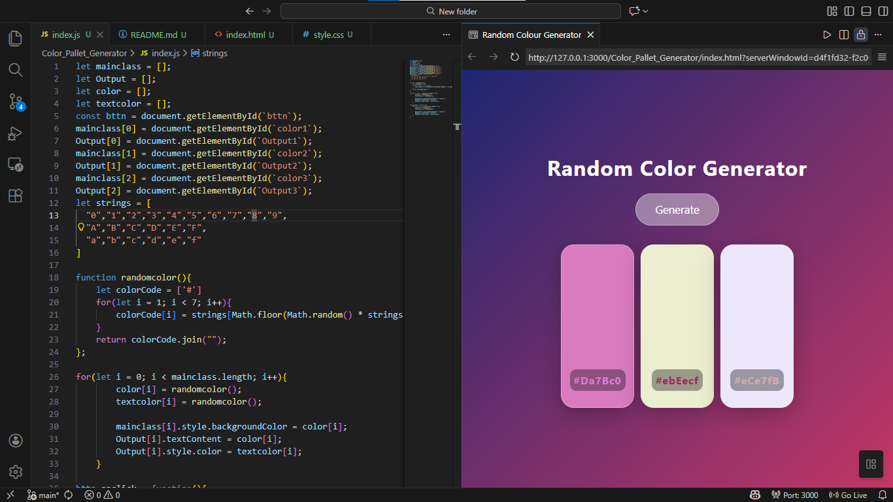

# 🎨 Random Color Generator App


A stylish **Random Color Generator** web app that generates beautiful random **HEX color codes** and displays them on glassmorphism cards. Built using **HTML, CSS, and JavaScript** with a modern frosted-glass UI.

---

## 🚀 Features

* **Generate random HEX colors** instantly.
* **Display 3 colors at once** for palette inspiration.
* **Visual HEX codes** displayed on each card.
* **Dynamic contrast:** Random text color logic for visibility.
* **Glassmorphism design:** Modern frosted-glass UI.
* **Responsive layout:** Works on desktop and mobile.

---

## 🧠 How It Works

1.  User clicks the **Generate** button.
2.  **JavaScript Logic:**
    * Creates random HEX color codes.
    * Applies them as background colors to the DOM elements.
    * Updates the text labels with the specific HEX value.
    * Randomizes text color for stylistic contrast.

---

## 🎨 Color Generation Logic

The app generates colors in the standard HEX format: `#RRGGBB`. Each character is randomly selected from a string containing `0–9` and `A–F`.

**Example:** `#3Fa9B2`

---

## 🛠 Tech Stack

* **HTML5:** Semantic structure.
* **CSS3:** Glassmorphism UI, gradients, and hover animations.
* **Vanilla JavaScript:** DOM manipulation and color logic.

---

## 📂 Project Structure

```text
random-color-generator/
│
├── index.html
├── style.css
└── index.js
```
---
## 📦 Installation

Clone the repository:

``` bash
git clone https://github.com/your-username/random-color-generator.git
````

Ensure these files are in the same directory:

* `index.html`
* `style.css`
* `index.js`

Open `index.html` in any modern web browser.

---

## 📸 Preview

> 💡 Add a screenshot of your app here to make your profile pop!



---

## ✨ Planned Future Features

* [ ] Copy to Clipboard — One-click to copy the HEX code
* [ ] Locking System — Lock a specific color while generating others
* [ ] Palette Expansion — Option to generate 5–10 colors
* [ ] Export — Save palettes as JSON or CSS variables

---

## 🎯 Goals of This Project

* Practice random number and string generation in JavaScript
* Master DOM manipulation
* Implement modern UI trends like Glassmorphism

---

## 📜 License

This project is open-source and free to use for learning and personal projects.

---

## 🙌 Author

Built by **Naseem**
Jack of all trades — building cool things one project at a time 🚀🔥

---
