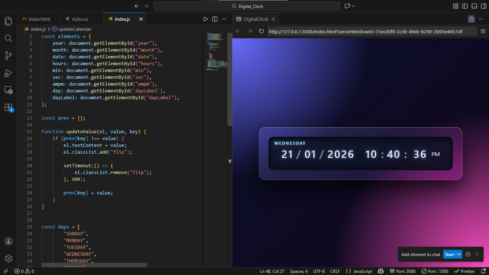

# Digital Clock

A sleek, animated digital clock that displays the current date and time in real time using smooth flip-style animations.


---

## Visual Preview



---

## Overview

**Digital Clock** is a modern front-end web project that displays the current date and time with elegant flip-style animations.

Built for developers and designers who appreciate clean UI, subtle motion, and real-time feedback, this project is ideal for practicing front-end fundamentals while delivering strong visual polish.

The clock runs entirely on the client side and updates every second with zero external dependencies.

---

## Features

- Real-time digital clock (updates every second)
- Displays:
  - Day of the week
  - Date, month, and year
  - Hours, minutes, and seconds
  - AM / PM indicator
- Smooth flip animations triggered only when values change
- Glassmorphism-inspired UI
- Fully responsive, centered layout
- Lightweight and dependency-free

---

## Tech Stack

### Core Technologies
- HTML5
- CSS3
- Vanilla JavaScript (ES6)

### Styling
- Custom CSS
- Gradients and glassmorphism effects
- CSS animations and keyframes

### Tooling
- No frameworks
- No build step
- Runs directly in the browser

---

## Project Type

- Front-end website / UI component

---

## Project Maturity

- Learning-focused project with production-level polish  
- Stable and complete

---

## Live Demo


**GitHub Pages:**  

>https://naseemchoudhary.github.io/JavaScriptBasicProjects/Digital_Clock/
---

## Installation & Setup

No installation required.

### Prerequisites
- Any modern web browser

### Run Locally

```bash
git clone https://github.com/NaseemChoudhary/JavaScriptBasicProjects.git
cd JavaScriptBasicProjects/DIGITAL_CLOCK
````


Open the following file in your browser:

```index.html```
---

## Usage

* Open the page
* The clock starts automatically
* Time and date update every second
* Flip animation triggers only when values change

The clock can also be embedded into other projects as a reusable UI component.

---

## Front-End Details

### Browser Compatibility

* Chrome
* Firefox
* Edge
* Safari (modern versions)

### Responsive Design

* Scales smoothly on smaller screens
* Uses flexible sizing and CSS clamp()

### Performance

* Minimal DOM updates
* Efficient interval-based logic
* No unnecessary re-renders

### Accessibility

* High-contrast text
* Clear visual hierarchy
* Subtle, purposeful motion

---

## Assets & Credits

* UI design and development: Project Author
* Fonts: System UI fonts (Segoe UI, system-ui)

No third-party libraries or assets were used.

---

## Roadmap

* 12h / 24h time format toggle
* Timezone selection
* Light / dark theme switcher
* Configurable animation speed

---

## Contributing

Contributions are welcome.

If you'd like to improve features, UI, or animations:

1. Fork the repository
2. Create a feature branch
3. Submit a pull request

---

## License

This project is licensed under the MIT License.
See the [LICENSE](LICENSE) file for details.

---

## Author

**Naseem**

* GitHub: [https://github.com/NaseemChoudhary](https://github.com/NaseemChoudhary)

---

> A focused front-end project that blends real-time data, animation, and visual clarity.
