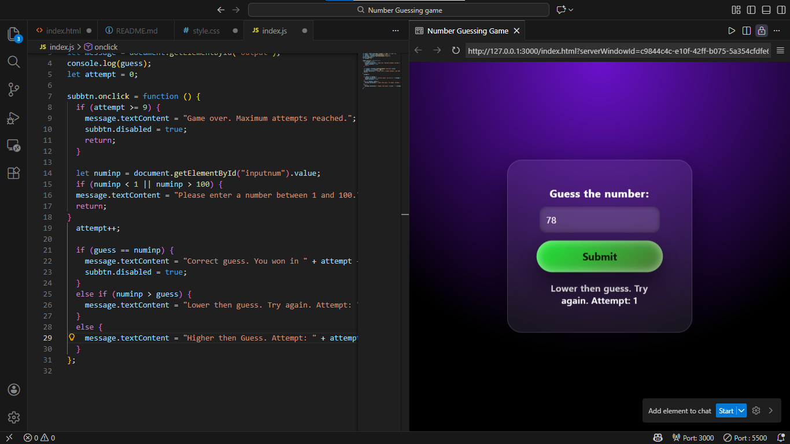

# 🎯 Number Guessing Game

A fun and interactive web game where the player must guess a randomly generated number between **1 and 100** within limited attempts. Built using **HTML, CSS (Glassmorphism UI), and JavaScript**.

---

## 🚀 Features

### ✅ Current Features

- [x] 🎲 Random Number Generation (1–100)
- [x] ⏳ Limited Attempts System
- [x] 📢 Smart Feedback Messages
  - [x] Correct guess
  - [x] Close guess (within ±10)
  - [x] Too far from the number
  - [x] Game over message
- [x] 🔒 Submit button disables after game ends
- [x] 🎨 Modern Glassmorphism UI
  - [x] Gradient background
  - [x] Floating card animation
  - [x] Hover effects on button

---

## 🧠 How It Works

- A random number is generated when the page loads using `Math.random()`.
- The player enters a number between **1 and 100**.
- On each submit:
  - If the guess is correct → player wins.
  - If the guess is within ±10 → shows "Close".
  - Otherwise → shows "Too far".
- After maximum attempts, the game ends and input is disabled.

---

## 🛠 Tech Stack

- HTML5
- CSS3 (Glassmorphism + Animations)
- Vanilla JavaScript

No frameworks or libraries are used.

---

## 📂 Project Structure

```text
number-guessing-game/
│
├── index.html
├── style.css
└── index.js 
```

---
## 📦 Installation

1. Download or clone the repository.
2. Ensure all files are in the same folder:
   - `index.html`
   - `style.css`
   - `index.js`
3. Open `index.html` in any modern web browser.

No setup required.

---

## 📸 Preview

Example:  


---

## ✨ Planned Improvements

### 🎮 Gameplay Enhancements

- [ ] Difficulty levels (Easy / Medium / Hard)


### 🎨 UI Improvements

- [ ] Win animation effects
- [ ] Lose animation effects
- [ ] Sound effects for feedback

### ⚙ Advanced Features

- [ ] Restart button
- [ ] Score tracking system
- [ ] Timer-based challenge mode

---

## 🎯 Goals of This Project

- Practice JavaScript conditionals and logic
- Improve DOM manipulation skills
- Learn basic game mechanics
- Design clean and modern UI layouts

---

## 📜 License

This project is free to use for learning, practice, and personal projects.

---

## 🙌 Authors

Built by **Naseem**  
Jack of all trades

Keep guessing. Keep coding.
