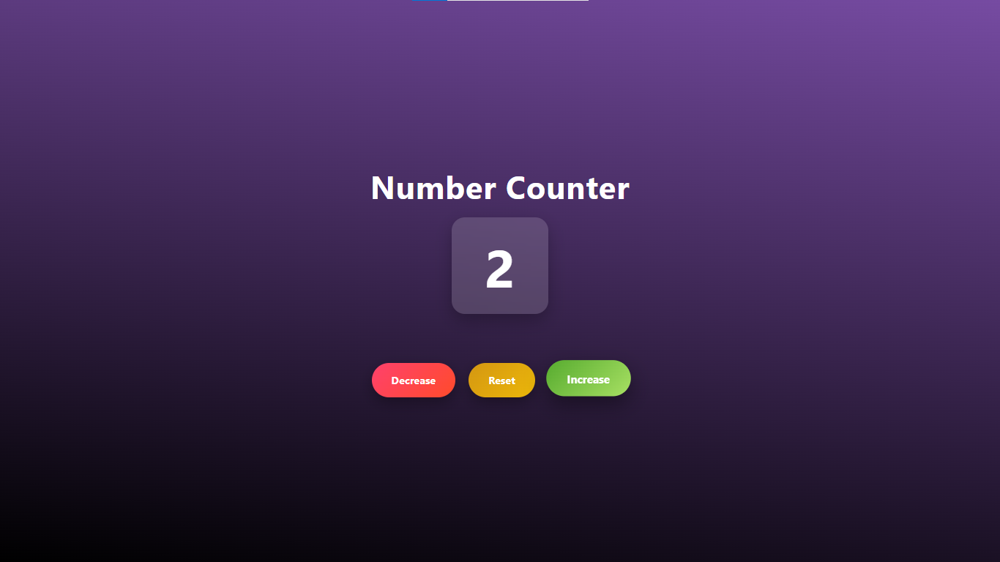

# 🔢 Number Counter App

A simple, modern, and responsive number counter built with **HTML, CSS, and JavaScript**.  
Users can increase, decrease, or reset a number using interactive buttons with a vibrant UI.

---

## ✨ Features
- [x] Increase counter
- [x] Decrease counter
- [x] Reset counter
- [x] Responsive layout
- [x] Smooth hover and click animations
- [x] Glassmorphism-style number display
- [ ] Sound effects
- [ ] Dark mode
- [ ] Keyboard support

---

## 🛠️ Built With

- **HTML5** – Structure
- **CSS3** – Styling and layout (Flexbox, gradients, animations)
- **JavaScript (Vanilla)** – Counter logic and DOM manipulation


---

## 📂 Project Structure

```text
number-counter/
│
├── index.html
├── style.css
└── index.js
```
---

## 🚀 How to Run the Project

1. Download or clone the repository
2. Open `index.html` in your web browser
3. Click the buttons to control the counter

No additional setup required.

---

## 📸 Preview

Example:



---

## 💡 Future Improvements

- 🔊 Add sound effects on button click
- 📈 Animate number transitions
- 🌙 Light/Dark mode toggle
- ⌨️ Keyboard controls

---

## 📄 License

This project is open source and available for learning and personal use.

---

## 🙌 Acknowledgements

Created as a practice project to improve skills in:
- DOM manipulation
- Event handling
- Responsive UI design

Feel free to customize and expand it!
