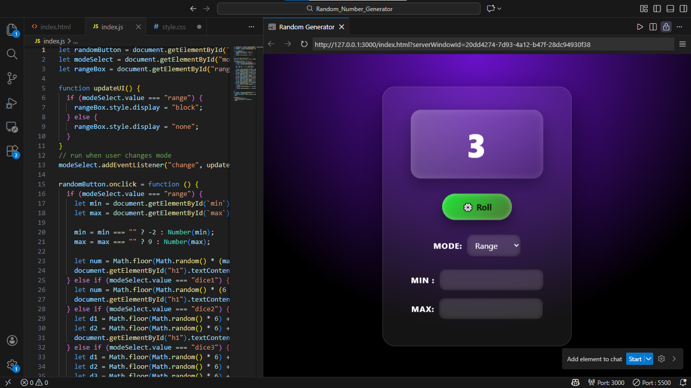

    
      
---

# 🎲 Random Generator App

A stylish and interactive **random generator web app** that supports multiple modes including **number ranges, animated dice rolls with images, and coin flips**.

Built with **pure HTML, CSS, and JavaScript**, featuring a modern glassmorphism UI and smooth animations.

---

## 🚀 Features

### 🎯 Random Number Generator
- Custom **minimum** and **maximum** values
- Default values used when inputs are empty
- Animated rolling effect before showing the final result

### 🎲 Dice Roll Mode (Updated)
- Roll **any number of dice**
- Displays numeric results
- **Dice images added**
- **Realistic dice roll animation** (spin, bounce, settle)
- Responsive layout for multiple dice

### 🪙 Coin Flip Mode
- Randomly returns **Head** or **Tail**

### 🎛 Mode Selector
- Dropdown menu to switch between modes
- UI updates automatically
- Inputs dynamically show or hide based on selected mode

### 🎨 Modern UI
- Glassmorphism card design
- Gradient background
- Hover and click animations
- Floating card animation
- Centered, responsive layout

---

## 🆕 Updates in the Latest Version

- Added **visual dice images**
- Implemented **real dice roll animation**
- Improved dice spacing and layout
- Updated UI styling
- Added preview image to the repository

---

## 🧠 How It Works

- Uses `Math.random()` to generate results
- JavaScript handles:
  - Mode switching
  - Dice generation
  - Input validation
  - UI updates
- CSS handles:
  - Animations
  - Glass blur effects
  - Layout and responsiveness

---

## 🛠 Tech Stack

- HTML5  
- CSS3 (Glassmorphism & animations)  
- Vanilla JavaScript  

No frameworks. No libraries. Just fundamentals.

---

## 📂 Project Structure

```text
random-generator/
│
├── index.html
├── style.css
├── index.js
└── Assets/
    └── dice images (1–6)
```

---

## 📦 Installation

1. Clone or download the repository
2. Ensure the following files exist:
   - `index.html`
   - `style.css`
   - `index.js`
   - `Assets/` (dice images)
3. Open `index.html` in your browser

---

## 📸 Preview



> Preview shows the **updated version with dice images and animations**.

---

## ✨ Planned Features

### UI / UX
- Improved mobile responsiveness
- Theme switcher (dark / neon / retro)

### Sound & Feedback
- Dice rolling sound
- Coin flip sound

### New Modes
- Random picker from a list
- Card draw mode
- Slot machine mode
- Even/Odd challenge mode

### Advanced
- Roll history log
- Copy result to clipboard
- Keyboard shortcuts

---

## 🎯 Project Goals

- Practice JavaScript logic
- Improve DOM manipulation
- Learn CSS animations
- Build fun interactive tools

---

## 📜 License

Open-source and free to use for learning and personal projects.

---

## 🙌 Author

**Naseem**  
Jack of all trades 

**Keep rolling. Keep coding. 🚀**

---