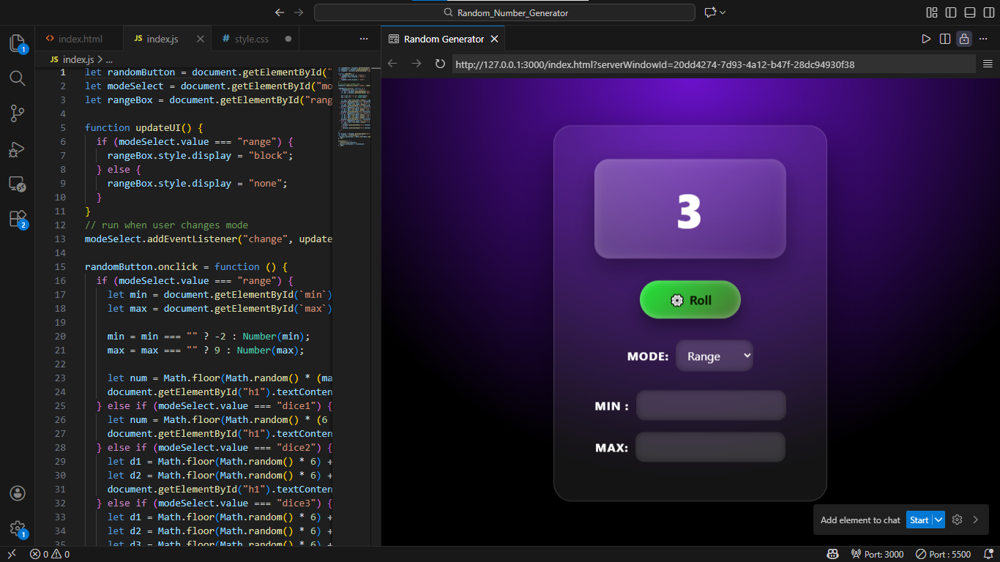

# 🎲 Random Generator App

A simple and stylish web app that generates random results based on different modes such as number ranges, dice rolls, and coin flips. Built using **HTML, CSS, and JavaScript**.

---

## 🚀 Features

### ✅ Current Features

- [x] 🎯 Random Number Generator (Custom Range)
  - [x] User can set **minimum** value
  - [x] User can set **maximum** value
  - [x] Default values used if inputs are empty

- [x] 🎲 Dice Roll Modes
  - [x] Single Dice Roll (1–6)
  - [x] Double Dice Roll (2 dice)
  - [x] Triple Dice Roll (3 dice)

- [x] 🪙 Coin Flip Mode
  - [x] Randomly returns **Head** or **Tail**

- [x] 🎛 Mode Selector
  - [x] Dropdown to switch between modes
  - [x] UI updates automatically when mode changes

- [x] 🎨 Modern UI Design
  - [x] Glassmorphism style card
  - [x] Gradient background
  - [x] Hover and click animations on button
  - [x] Responsive center layout

---

## 🧠 How It Works

- Uses `Math.random()` to generate random values
- JavaScript controls:
  - Mode switching
  - Showing/hiding range inputs
  - Displaying results
- CSS handles:
  - Animations
  - Layout
  - Glass blur effects

---

## 🛠 Tech Stack

- HTML5
- CSS3 (Glassmorphism + Animations)
- Vanilla JavaScript

No frameworks, no libraries — just clean fundamentals 💪

---

---

## 📂 Project Structure

```text
number-counter/
│
├── index.html
├── style.css
└── index.js
```
---


## 📦 Installation

1. Clone or download the repository
2. Make sure these files are in the same folder:
   - `index.html`
   - `style.css`
   - `index.js`
3. Open `index.html` in your browser

Done ✅

---

## 📸 Preview

Example:



---

## ✨ Planned Future Features

### 🔥 UI / UX Improvements

- [ ] 🎞 Roll animation before result appears
- [ ] ✨ Glow effect when number is shown
- [ ] 📱 Improved mobile responsiveness
- [ ] 🌈 Theme switcher (dark / neon / retro)

### 🔊 Sound & Feedback

- [ ] 🔊 Dice rolling sound effect
- [ ] 🪙 Coin flip sound
- [ ] 🎉 Win-style sound for special results

### 🎮 New Modes

- [ ] 🎯 Random Picker from List (names, tasks, etc.)
- [ ] 🎴 Card draw mode (Ace–King)
- [ ] 🎰 Slot machine mode
- [ ] 🔢 Even/Odd challenge mode

### ⚙ Advanced Features

- [ ] 📊 History log of previous rolls
- [ ] 📋 Copy result to clipboard
- [ ] 🎥 Rolling animation using intervals
- [ ] ⚡ Keyboard shortcut for rolling

---

## 🎯 Goals of This Project

- Practice JavaScript logic
- Learn DOM manipulation
- Improve CSS design skills
- Build fun interactive tools

---

## 📜 License

This project is open-source and free to use for learning and personal projects.

---

## 🙌 Author

Built by **Mario** —  
Jack of all trades, all master 😤🔥

Keep rolling. Keep coding. 🚀
