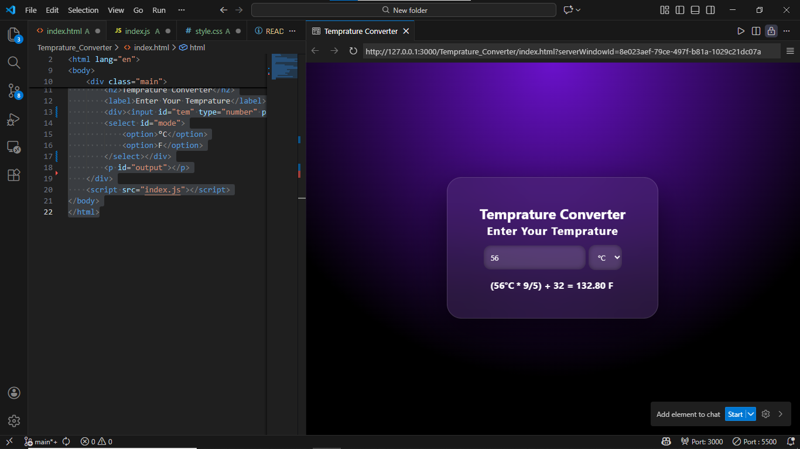

# 🌡 Temperature Converter App


A simple and modern **Temperature Converter** web app that converts between  
**Celsius (°C)** and **Fahrenheit (F)** instantly as you type.  
Built using **HTML, CSS, and JavaScript** with a glassmorphism UI design.

---

## 🚀 Features

- Convert Celsius to Fahrenheit
- Convert Fahrenheit to Celsius
- Live conversion while typing (no button required)
- Unit selection using dropdown
- Formula shown with result
- Glassmorphism style card
- Gradient animated background
- Centered responsive layout

---

## 🧠 How It Works

1. User enters a temperature value
2. User selects the unit (°C or F)
3. JavaScript automatically:
   - Reads the input
   - Applies the correct formula
   - Displays the converted result

### 📐 Formulas Used

- **Celsius to Fahrenheit**  
  `(°C × 9/5) + 32`

- **Fahrenheit to Celsius**  
  `(F − 32) × 5/9`

---

## 🛠 Tech Stack

- HTML5
- CSS3 (Glassmorphism + Animations)
- Vanilla JavaScript

---

## 📂 Project Structure

```text
temperature-converter/
│
├── index.html
├── style.css
└── index.js
```

---
## 📦 Installation

1. Download or clone the project

2. Make sure these files are in the same folder:
   - `index.html`
   - `style.css`
   - `index.js`

3. Open `index.html` in your browser

---

## 📸 Preview



---

## ✨ Planned Future Features

### UI Improvements

- Smooth output animation  
- Glow effect on result text
- Better mobile responsiveness  
- Light / Dark theme switch  

### Functional Upgrades

- Optional convert button  
- Copy result to clipboard  
- Conversion history log  
- Sound feedback (optional)  

---

## 🎯 Goals of This Project

- Practice JavaScript calculations  
- Learn real-time DOM manipulation  
- Improve CSS design skills  
- Build useful mini tools  

---

## 📜 License

This project is open-source and free to use for learning and personal projects.

---

## 🙌 Author

Built by **Naseem**  
Learning, building, and improving every day.
